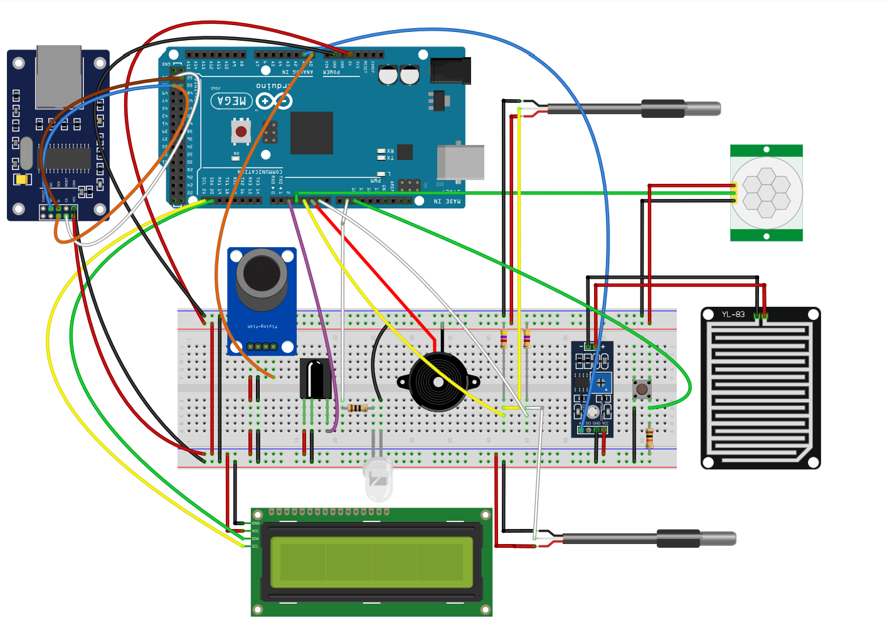

## Smart Home 2560

Desenvolvemos um sistema embarcado usando a plataforma Arduino Mega 2560, equipado com o microcontrolador ATMEGA2560. O projeto possui diversos sensores, incluindo um sensor de umidade, sensor de temperatura interno e externo, sensor de presença, receptor infravermelho e sensor de gás. Também conta com atuadores, como buzzer, display LCD e emissor infravermelho.

O objetivo desse sistema é automatizar processos dentro de uma residência, permitindo o controle por meio de uma página WEB utilizando um conector LAN. Isso possibilita ajustar configurações, monitorar os sensores em tempo real e tomar decisões para melhorar o conforto, segurança e eficiência energética do lar.

### Pré-requisitos

* 1 - Plataforma de prototipagem Arduino MEGA
* 1 - Sensor de gás MQ-2
* 1 - Alarme Buzzer 5V
* 1 - Visor LCD I2C 16x2
* 1 - Transmissor infravermelho
* 1 - Receptor infravermelho VS1838B
* 1 - Módulo Ethernet ENC28J60
* 1 - Sensor de Chuva Rain Drop MH-RD
* 1 - Botão Switch
* 1 - Sensor de presença PIR HC-SR5011
* 2 - Sensor de temperatura DS18B20
* 2 - Protoboard 400 furos
* 2 - Resitência sensores p/ temperatura de 4.7k Ohm
* 1 - Resistência p/ botão de 10k Ohm
* 1 - Resistência p/ LED IR de 10 Ohm
* 10 - Fio de conexão Jumper Fêmea 20cm
* 35 - Fio de conexão Jumper Macho 20cm

## Bibliotecas Utilizadas:

* .[DallasTemperature](https://www.milesburton.com/Dallas_Temperature_Control_Library)
* .[IRremote](https://github.com/Arduino-IRremote/Arduino-IRremote?utm_source=platformio&utm_medium=piohome)
* .[LiquidCrystal_I2C](https://github.com/johnrickman/LiquidCrystal_I2C?utm_source=platformio&utm_medium=piohome)

## Começando
Para rodar o projeto você pode estar utilizando do código fonte disponível na pasta `/scr` e também as bibliotecas
e realizar o upload no arduino atráves do `Arduino IDE`. Ou também você pode clonar essa pasta e abrir utilizando o `plataformIO` onde será possível realizar o upload juntamente das bibliotecas utilizadas

## Autores
* **[Eduardo Oliveira](https://github.com/duardoliveiras)**
* **[Matheo Bonucia](https://github.com/tanakagl)**
* **Eduardo Fernandes Bruno dos Reis**
* **João Victor Villar Boas Pimenta Neves**
* **Pedro Marcos Neves Alves**

## Expressões de gratidão

* Gostaria de agradecer ao professor Doutor Jésus Franco Bueno por sua orientação e apoio no ensino de sistemas embarcados e microcontroladores.

